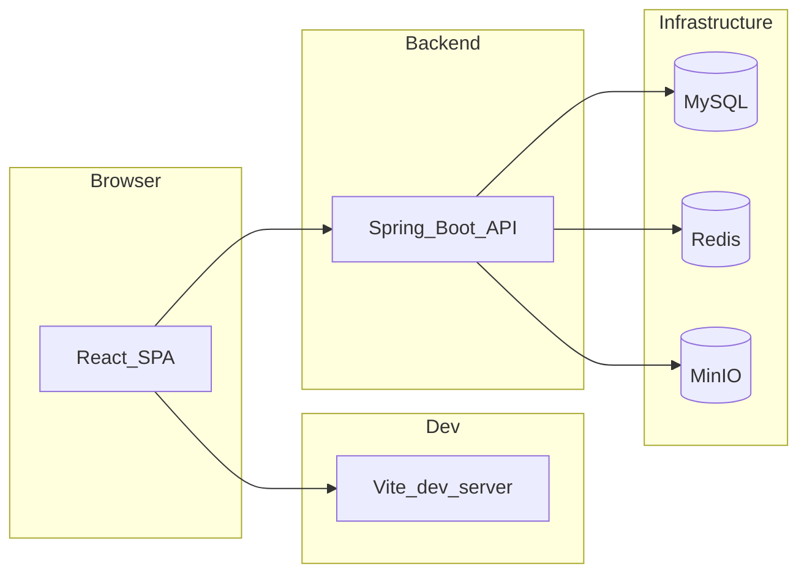

# BaseProject

多租户业务管理后台 + 平台运营端，前后端分离。默认前端品牌名为「KMR管理系统」（可通过 `VITE_APP_*` 覆盖）。

**定版信息**：版本号与定版日期请与 Git tag / 发布说明对齐后在此填写（例如：`v1.0.0` / `2026-xx-xx`）。

---

## 架构概览



- **前端**：React 19、Vite 8、Ant Design 6、React Router 7、Zustand、Axios（详见 [frontend/README.md](frontend/README.md)）。
- **后端**：Spring Boot 2.7.x、Java 8、MyBatis-Plus、动态数据源、Redis、MinIO、springdoc-openapi（详见 [backend/readme.md](backend/readme.md)）。

---

## 功能范围（与路由、菜单种子一致）

### 租户端（`/login` 登录后）

- **工作台**（`/`）、**消息中心**（`/messages`）
- **系统管理**（侧栏菜单）：用户、机构、角色、菜单、字典、配置中心、会话、审计、日志、**运行日志**（外链/集中式运维日志，非 JVM 本地文件 tail；配置见 `baseproject.ops-logs`）
- **个人中心**（`/profile`）

### 平台端（`/platform/login` 登录后）

- 租户管理、平台账号、平台角色、平台审计、平台公告、平台配置、跨租户协助、平台日志等（路径均以 `/platform/` 开头）

### AI / 贡献者约定（可选）

- 仓库根 [AGENTS.md](AGENTS.md) 供自动化助手与协作者参考。

---

## 仓库结构

| 路径 | 说明 |
|------|------|
| [frontend/](frontend/) | 单页应用源码、Vite 配置、环境变量 |
| [backend/](backend/) | Spring Boot 工程、`application*.yml` |
| [sql/](sql/) | 库表结构、初始化种子、演示数据脚本 |

### SQL 脚本说明

| 文件 | 用途 |
|------|------|
| [sql/init_schema.sql](sql/init_schema.sql) | 建库表、索引等（**首次必执行**） |
| [sql/init_data.sql](sql/init_data.sql) | 默认租户、管理员、权限、菜单、基础配置等（**在 schema 之后执行**） |
| [sql/demo_data.sql](sql/demo_data.sql) | 可选；在 init 完成后追加演示机构/用户/字典等，详见文件头注释 |

若从旧版本升级，请另行维护 `ALTER`/迁移脚本并与当前 `init_schema.sql` 对比补列（本仓库 `sql/` 下以实际存在的升级文件为准）。

---

## 环境前置条件

| 组件 | 说明 |
|------|------|
| JDK | 8+（与后端 `pom.xml` 一致） |
| Maven | 3.x |
| Node.js | 建议 **20+**（Vite 8 / React 19 需较新 Node；以本机能 `npm run dev` 为准） |
| MySQL | 与 JDBC 一致，默认库名 **`baseproject`**（见 `application-dev.yml`） |
| Redis | 默认 `127.0.0.1:6379`（`application-dev.yml`） |
| MinIO | 默认 `http://127.0.0.1:9000`，桶名 **`base-project`**；首次上传时若桶不存在，后端会尝试创建（见 `FileService`） |

Windows / Linux / macOS 均可；命令行示例以 POSIX 为主，Windows 可使用 PowerShell 等价命令。

---

## 数据库初始化

1. 创建数据库：`CREATE DATABASE baseproject ...`（字符集建议 `utf8mb4`）。
2. 执行：`init_schema.sql` → `init_data.sql`。
3. 可选：执行 `demo_data.sql`（演示数据，见文件头说明）。

### 默认账号（仅开发/演示；**生产必须改密**）

| 用途 | 用户名 | 初始密码来源 |
|------|--------|----------------|
| 租户管理员 | `admin` | `init_data.sql` 中变量 `@default_password_plain`（当前种子为 **`Admin@123456`**） |
| 平台管理员 | `platform_admin` | 同上 |

BCrypt 哈希见 `init_data.sql` 中 `@default_password_hash` 注释说明。

---

## 依赖中间件（开发）

1. 启动 **MySQL**，创建库并执行上述 SQL。
2. 启动 **Redis**（与 `application-dev.yml` 一致）。
3. 启动 **MinIO**（Access/Secret 与 `application-dev.yml` 中 `minio.*` 一致；或使用控制台创建用户与桶 `base-project`）。

---

## 本地联调（最短路径）

### 1. 后端

```bash
cd backend
mvn spring-boot:run
```

- 默认端口：**8080**（[application.yml](backend/src/main/resources/application.yml)）
- 默认激活配置：**`dev`**（`spring.profiles.active`）
- 开发环境数据源与 Redis/MinIO：见 [application-dev.yml](backend/src/main/resources/application-dev.yml)（含 `core` / `biz` 双数据源；当前业务代码主要使用 **`core`** 数据源）

### 2. 前端

```bash
cd frontend
npm install
npm run dev
```

- 开发服务器默认端口一般为 **5173**（Vite 默认，以控制台输出为准）。
- **API 地址**：在 [frontend/.env](frontend/.env) 中配置 `VITE_API_BASE_URL`。
  - 设为 **`http://localhost:8080`**（或实际后端地址）：浏览器直连后端，需后端 CORS 允许（项目已配置 `WebMvcConfig` 全局 CORS）。
  - 设为 **空字符串 `""`**：走 [vite.config.js](frontend/vite.config.js) 代理，`^/(auth|tenant|platform|api)` 转发到 `http://127.0.0.1:8080`，且保留浏览器 `Host`（便于子域租户解析；详见 `application-dev.yml` 顶部注释与 [frontend/README.md](frontend/README.md)）。

### 3. 子域租户（可选，dev）

在 `application-dev.yml` 中启用 `baseproject.auth.tenant-from-host` 时，需配置本机 **hosts**（示例见该文件注释，如 `127.0.0.1 default.localhost`），前端 dev 常配合 **`VITE_API_BASE_URL=""`** 使用代理。

---

## 生产构建与部署（概要）

### 前端

```bash
cd frontend
npm run build
```

产物目录：`frontend/dist/`。由 Nginx 等托管静态资源；生产环境通过 `VITE_API_BASE_URL`（构建时注入）指向网关或后端 HTTPS 地址。SPA 需配置 `try_files` 回退到 `index.html`。

### 后端

```bash
cd backend
mvn -DskipTests package
java -jar target/backend-0.0.1-SNAPSHOT.jar --spring.profiles.active=prod
```

- 可执行 JAR 名：`artifactId` + `version`（见 [backend/pom.xml](backend/pom.xml)）。
- **生产配置**：见 [application-prod.yml](backend/src/main/resources/application-prod.yml)，通过环境变量注入 `CORE_DB_*`、`BIZ_DB_*`、`REDIS_*`、`MINIO_*` 等（**勿将密钥写入仓库**）。

---

## API 文档（Swagger）

后端启动后（默认未改路径时）：

- Swagger UI：`http://<host>:8080/swagger-ui.html`
- OpenAPI JSON：`http://<host>:8080/v3/api-docs`

与 [application.yml](backend/src/main/resources/application.yml) 中 `springdoc` 配置一致。

---

## 版本与变更记录

- 若未单独维护 CHANGELOG.md，重大变更以 Git 提交记录与 tag 说明为准。

---

## 许可证

内部项目 / 待定（请按贵司合规补充）。

---

## 更多文档

- [frontend/README.md](frontend/README.md) — 前端目录、环境变量、代理、鉴权、构建与 FAQ  
- [backend/readme.md](backend/readme.md) — 后端包结构、配置、数据源、定时任务、运行日志、安全与 FAQ  
